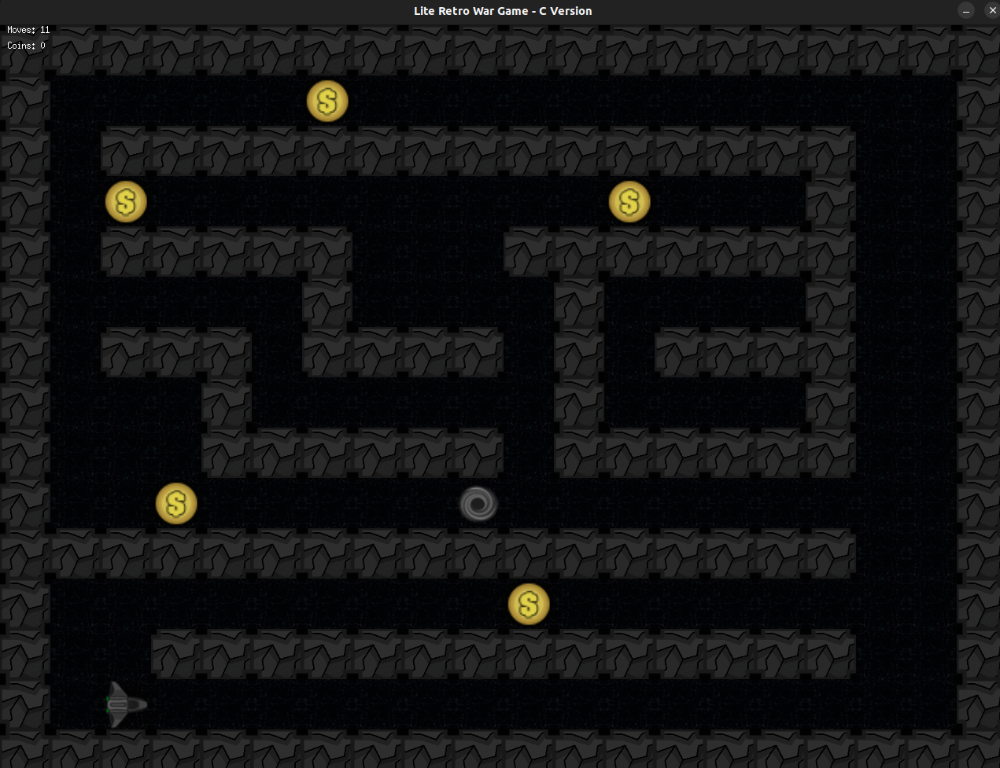
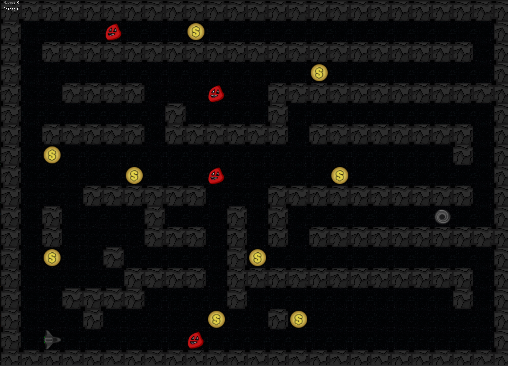
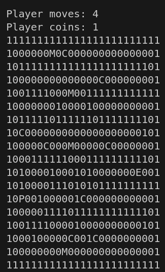

# so_long
so_long is a 2D maze game where the player navigates a character to reach an exit, using basic graphics and C programming. It features player movement, collision detection, and simple game logic.

The game checks for a valid map (enclosed by walls, with only one mandatory player), a mandatory exit, and ensures the map has a correct path. Both the exit and all the coins must be reachable. Otherwise, the path will be considered invalid. Once the validations are completed, the game starts. Maps are located in the "maps" folder.

1 = Wall
0 = Air
P = Player
C = Coin
E = Exit
M = Monster (only in the bonus part)

The map is stored in a single array, ignoring line breaks. Map data is stored in a structure, which allows identifying the row where the character to process is located. The player must collect all the coins and head to the exit (the black hole).

<p align="center">
  
</p>

The game uses the DFS (Depth-First Search) algorithm to validate the map. This algorithm explores paths by going as deep as possible along each branch before backtracking. It's used to ensure the exit and all coins are reachable from the player's starting position.

The enemy has a basic horizontal movement, shifting left to right.

<p align="center">
  
</p>

# How to Run the Game

### Regular Version:
```bash
make
./so_long <map>
```

### Bonus Version:
```bash
make bonus
./so_long <map>
```

### Example:
```bash
make
./so_long maps/map1.ber
```

The game is also rendered in the console.

<p align="center">
  
</p>
